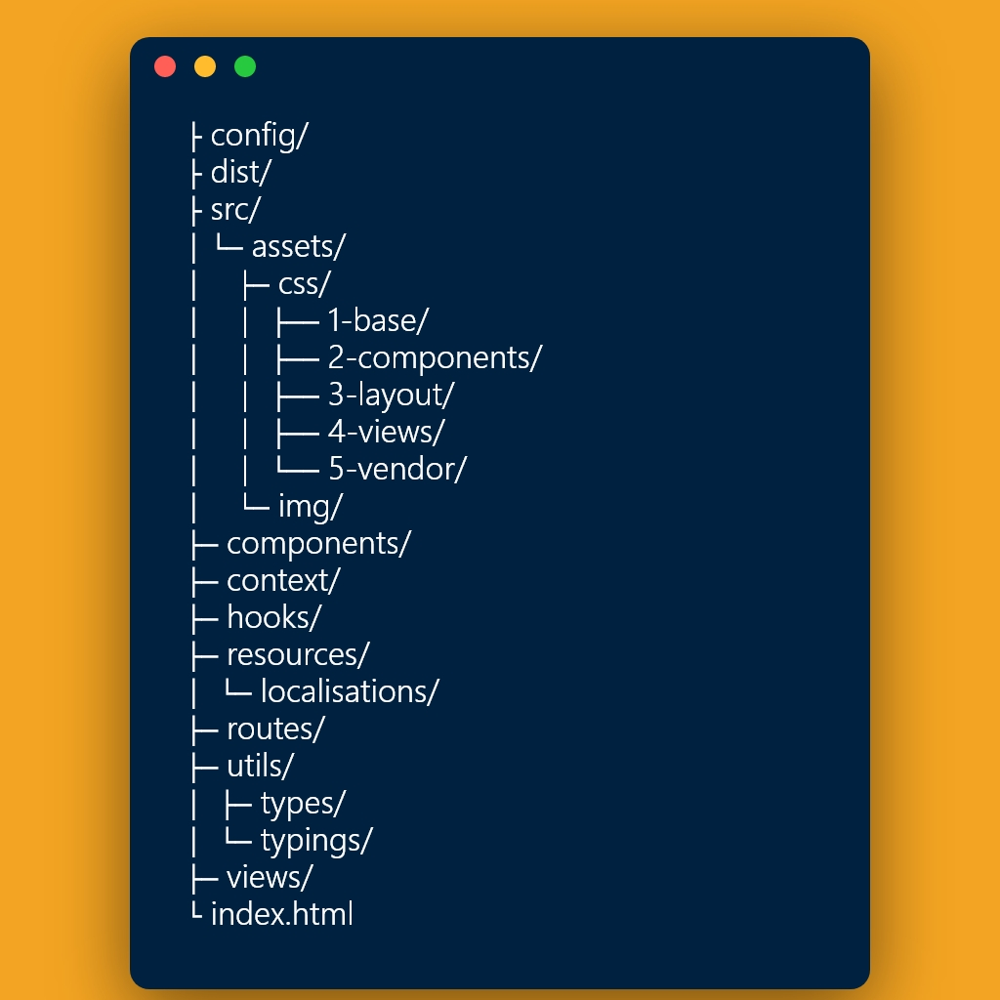

# A clean React Folder Structure

Every file is clean and without code, simply clone it and you are ready to go.
Because there is no right way to do it you still can remove or add some folders, depends on technologies you gonna use or your opinion.

Suggestions are welcome.
#### Tree

